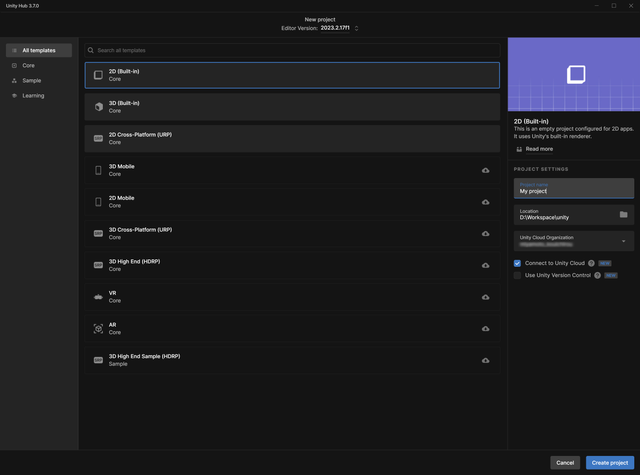
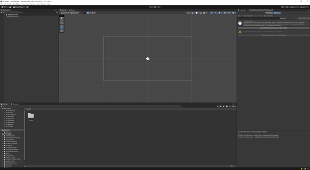
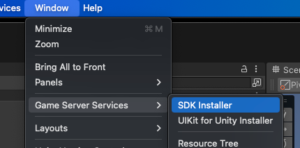
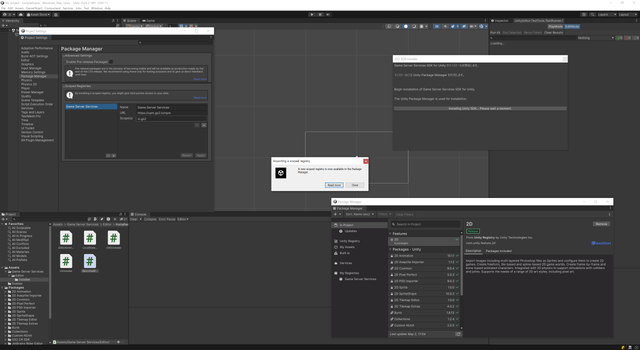
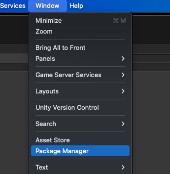
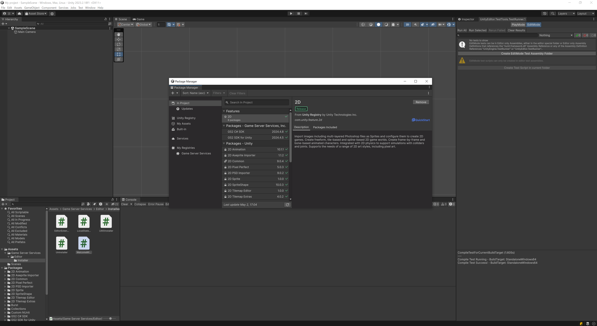
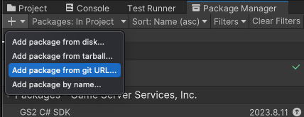
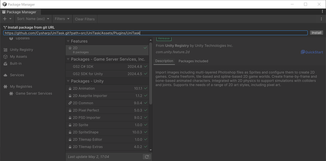
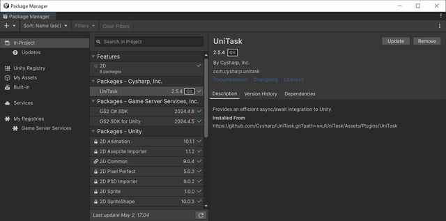

# Unityプロジェクトの準備

## GS2 SDKのインストール

Unity Hub からプロジェクトを新規作成します。



作成したUnityのプロジェクトに、プラグインとして「GS2-CSharp-SDK」と「GS2 SDK for Unity」をインストールします。



ダウンロードはGS2のドキュメントページ、[GS2の利用を開始](https://docs.gs2.io/ja/get_start/) のページから行います。


インストーラーをダウンロードし、ダウンロードした unitypackage を実行します。
unitypackage のインポートが終わったら 「Window > Game Server Services > SDK Installer」 を選択します。



インストーラーが起動するので、手順に従ってSDKのインストールを実行します。



「Window > Package Manager」を選択します。



Package Manager に Game Server Services が追加されていることを確認します。



## UniTask をインストール

プロジェクトに非同期処理のライブラリである UniTask をインストールします。
UniTask は Unity で非同期の処理を実装する際にコルーチンではなく、async/await 記法を利用可能にするプラグインです。
GS2 SDK は UniTask が Package Manager 経由でインストールされている場合は async/await に特化した API が利用可能となり、より直感的なコードを書くことができます。

Package ManagerからGit Hubリポジトリ経由でインストールします。
「+ > Add package from git URL...」を選択します。



以下のURLを入力して追加します。

```
https://github.com/Cysharp/UniTask.git?path=src/UniTask/Assets/Plugins/UniTask
```



UniTask のインストールが完了しました。



これで、Unityプロジェクトの準備が完了しました。

## このステップが終わった段階でのプロジェクト

[ソースコード](src)

## 次のステップへ

[GS2-Account でログイン処理を実装](../step0002)