# Unity 上で GS2-Exchange の交換を実行してガチャチケットを入手できるように

### ホーム画面を作成

ログイン完了後に表示されるホーム画面を作成します。
ホーム画面には以下の Prefab を使用します。ダウンロードしたデータをプロジェクトの「Assets/Prefabs」に配置します。

[ホーム画面の Prefab](prefab/HomePanel.prefab)

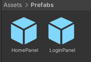

次に、HomePanel をシーンに配置します。

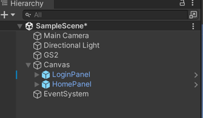

HomePanel はデフォルトで無効化し、ログイン完了時に表示するようにします。

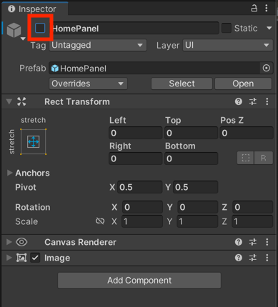

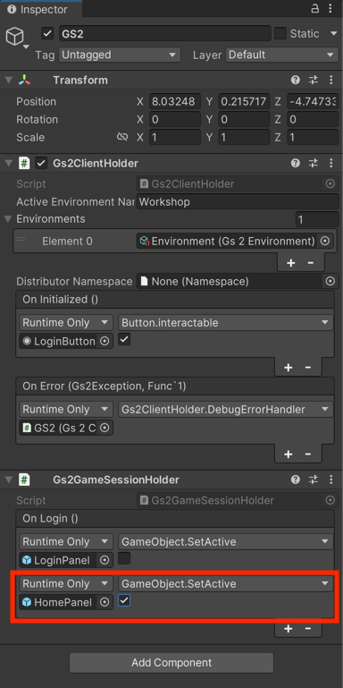

### ガチャチケットの所持状況を表示するように

ガチャチケットの所持状況をテキストに反映する C# コードを作成します。
Inventory.cs を作成し、以下のコードを記述します。

```csharp
using System;
using System.Collections;
using System.Linq;
using Cysharp.Threading.Tasks;
using Cysharp.Threading.Tasks.Linq;
using Gs2.Core.Exception;
using Gs2.Unity.Gs2Inventory.Model;
using Gs2.Unity.Util;
using TMPro;
using UnityEngine;
using UnityEngine.Events;

public class Inventory : MonoBehaviour
{
    [SerializeField] private TMP_Text inventory;
    
    public SuccessEvent onReload;
    public ErrorEvent onFailure;

    private void OnEnable() {
        async UniTask SubscribeAsync()
        {
            void Reload(EzItemSet[] items) {
                if (items.Length == 0) {
                    // チケットを一枚も持っていない
                    this.inventory.SetText("Do not have a ticket");
                }
                else {
                    // 何らかのチケットを持っている
                    this.inventory.SetText(string.Join("\n", items.Select(item => $"{item.ItemName}: x{item.Count}")));
                }
                
                this.onReload.Invoke();
            }
            
            try
            {
                var domain = Gs2ClientHolder.Instance.Gs2.Inventory.Namespace(
                    namespaceName: "LotteryTicket"
                ).Me(
                    gameSession: Gs2GameSessionHolder.Instance.GameSession
                ).Inventory(
                    inventoryName: "Bag"
                );
                
                // 所持しているアイテムの一覧に変化があった時に呼び出されるコールバックを追加
                domain.SubscribeItemSets(Reload);
                
                // 初期値を設定
                Reload(await domain.ItemSetsAsync().ToArrayAsync());
            }
            catch (Gs2Exception e)
            {
                this.onFailure.Invoke(e, null);
            }
        }
        StartCoroutine(SubscribeAsync().ToCoroutine());
    }

    [Serializable]
    public class SuccessEvent : UnityEvent
    {
    }
    
    [Serializable]
    public class ErrorEvent : UnityEvent<Gs2Exception, Func<IEnumerator>>
    {
    }
}
```

コードを見ればわかるように、この C# コードは GS2-Inventory の Bag 内のアイテムを監視し、所持しているアイテムの一覧を自動的にテキストに反映します。
この監視はサーバーから発行されるデータ更新通知をを元に実行されるため、短期間でAPIコールを呼び出して値の変化を監視するようなことはなく、利用料金への影響を気にする必要がありません。

この C# コードを HomePanel/Inventory にアタッチします。

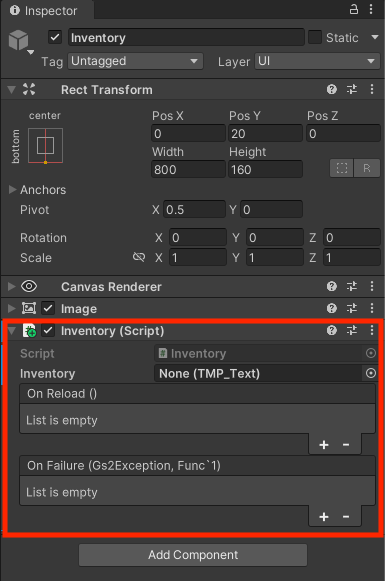

次にテキスト(HomePanel/Inventory/Text(TMP)) をアタッチします。

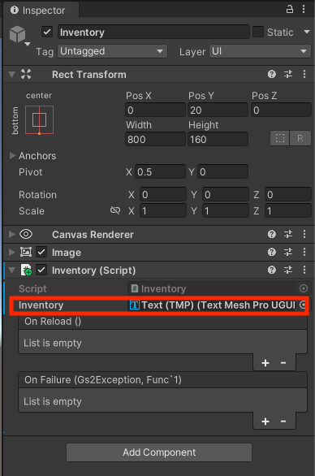

最後に、エラーハンドラーをアタッチします。

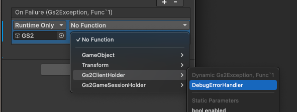

### ガチャチケットを入手できるように

ガチャチケットを入手する C# コードを作成します。
AcquireTicket.cs を作成し、以下のコードを記述します。

```csharp
using System;
using System.Collections;
using Cysharp.Threading.Tasks;
using Gs2.Core.Exception;
using Gs2.Unity.Util;
using UnityEngine;
using UnityEngine.Events;

public class AcquireTicket : MonoBehaviour
{
    public SuccessEvent onSuccess;
    public ErrorEvent onFailure;
    
    public void Exchange(string exchangeRateName)
    {
        async UniTask ExchangeAsync(string exchangeRateName)
        {
            try
            {
                // 交換処理を実行
                var transaction = await Gs2ClientHolder.Instance.Gs2.Exchange.Namespace(
                    namespaceName: "AcquireLotteryTicket"
                ).Me(
                    gameSession: Gs2GameSessionHolder.Instance.GameSession
                ).Exchange(
                ).ExchangeAsync(
                    rateName: exchangeRateName,
                    count: 1
                );

                // 交換処理の完了を待つ
                await transaction.WaitAsync(true);
                
                this.onSuccess.Invoke();
            }
            catch (Gs2Exception e)
            {
                this.onFailure.Invoke(e, () => ExchangeAsync(exchangeRateName).ToCoroutine());
            }
        }
        
        StartCoroutine(ExchangeAsync(exchangeRateName).ToCoroutine());
    }
    
    [Serializable]
    public class SuccessEvent : UnityEvent
    {
    }
    
    [Serializable]
    public class ErrorEvent : UnityEvent<Gs2Exception, Func<IEnumerator>>
    {
    }
}
```

次に、ボタンをクリックしたら AcquireTicket.Exchange を呼び出すようにします。
引数には GS2-Exchange の交換レートの情報を指定します。

AcquireTicket-1 Button に AcquireTicket.cs をアタッチします。

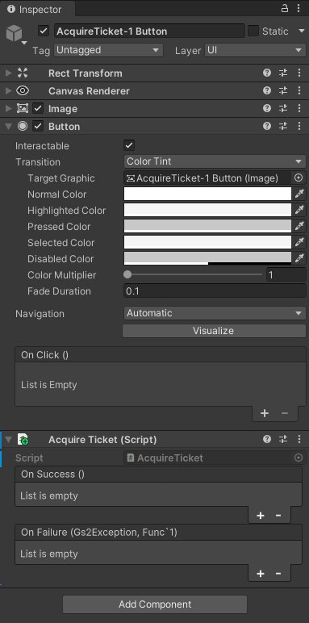

OnClick に AcquireTicket.Exchange をアタッチします。

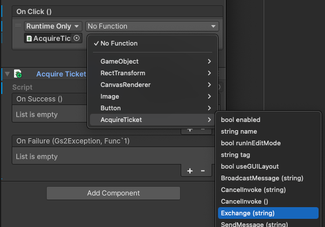

交換レート名に Ticket-1 を指定します。

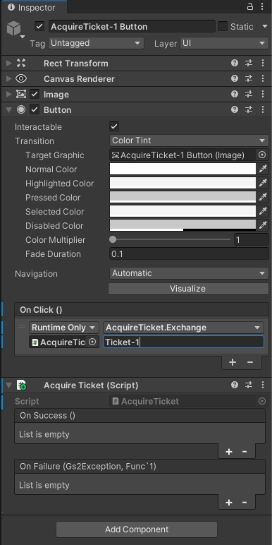

最後に、エラーハンドラーをアタッチします。

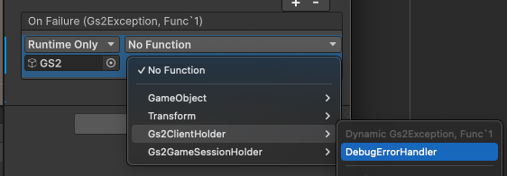

### 10連ガチャ用ガチャチケットを入手できるように

AcquireTicket-10 Button に AcquireTicket.cs をアタッチし、先ほどとどうようの設定を加えます。
一点だけ異なるのが交換レート名を Ticket-10 にすることです。

### 実行

起動すると 「Login」 ボタンが表示されます。

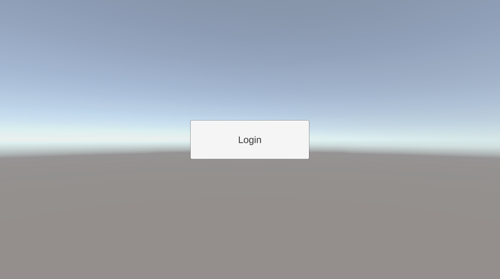

ボタンを押下すると、ホーム画面に遷移します。

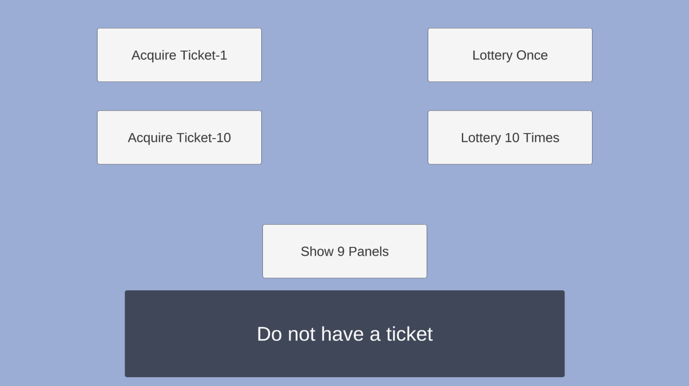

「Acquire Ticket-1」 ボタンを押下すると、単発ガチャチケットが入手でき、テキストに反映されます。

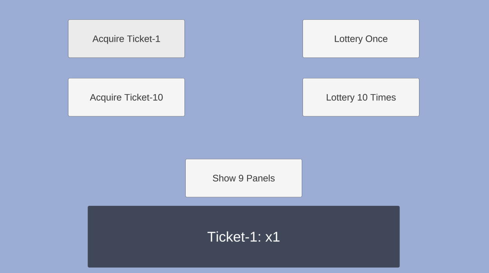

複数回ボタンを押下するとその分チケットの数量が増えます。

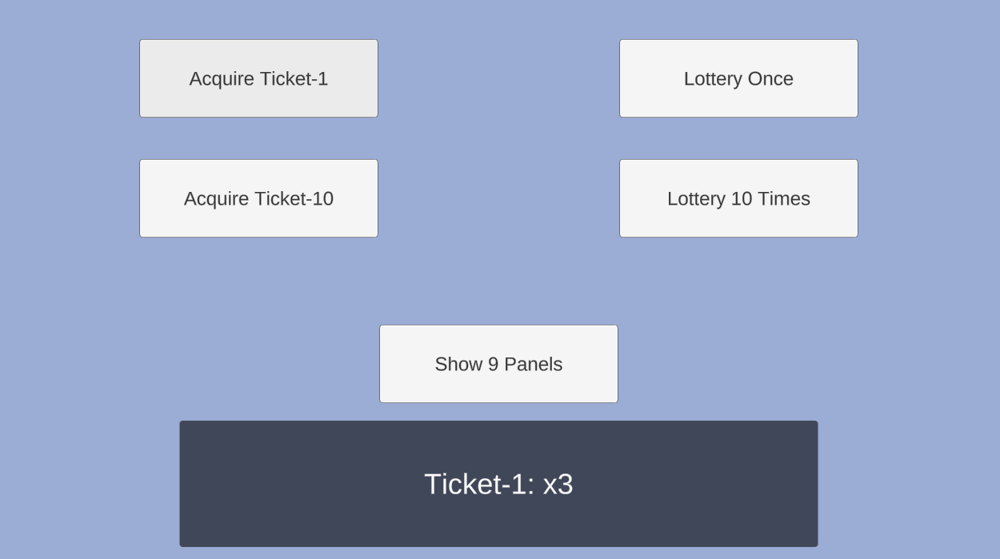

「Acquire Ticket-10」 ボタンを押下すると、10連ガチャチケットが入手でき、テキストに反映されます。

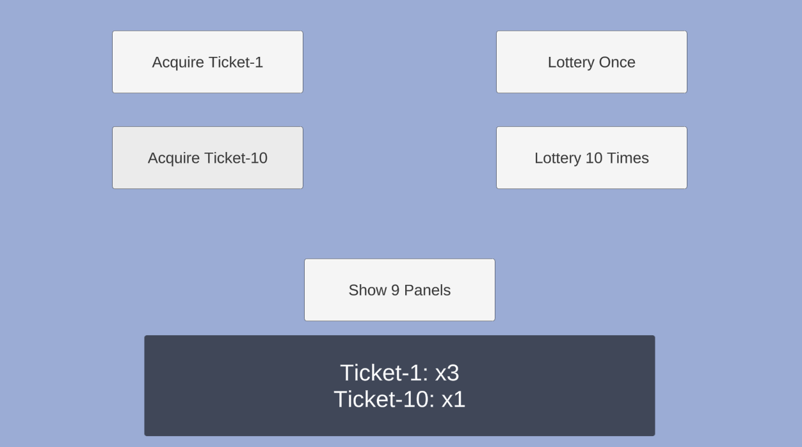

## このステップが終わった段階でのプロジェクト

[ソースコード](src)

## 次のステップへ

[GS2-Dictionary に9パネルを登録](../step0006)