# GS2-Dictionary に9パネルを登録

## GS2-Dictionary の設定

### ネームスペースの作成

まずは、GS2-Dictionary にガチャから排出される 9パネル の所持パネルを管理するネームスペースを作成します。

マネージメントコンソールのサイドメニューから「Dictionary > Namespaces」を選択します。

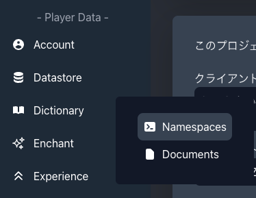

次に「ネームスペースの新規作成」を選択します。

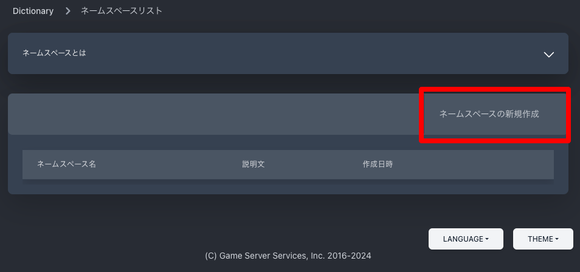

ネームスペースの設定項目を入力して「作成」ボタンを押下します。

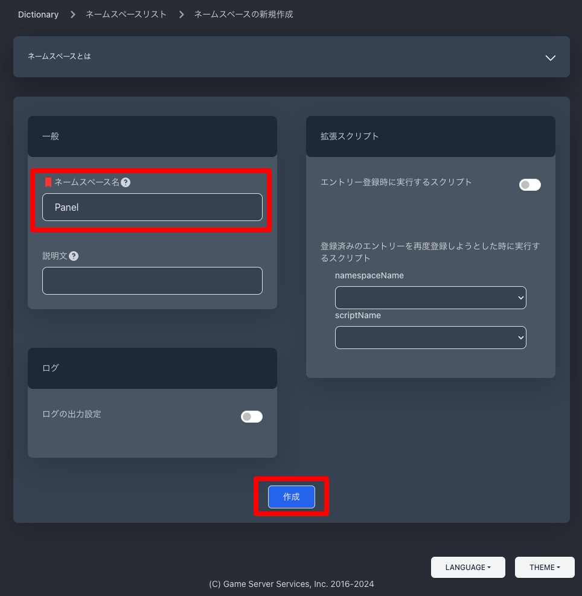

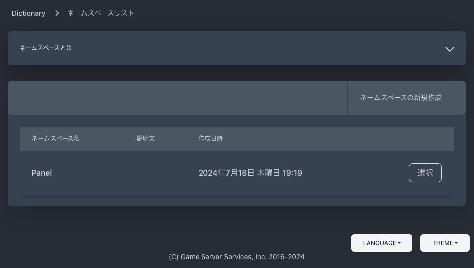

### マスターデータの作成

先ほどと同様にマスターデータエディタを選択します。

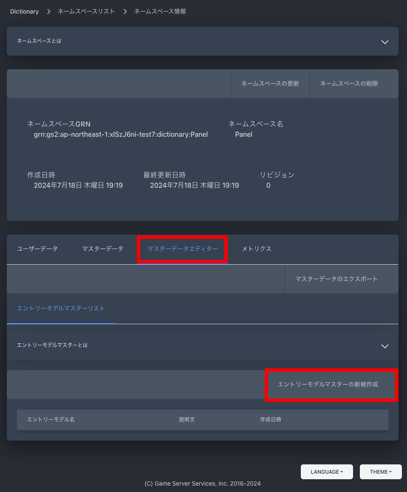

「エントリーモデルマスターの新規作成」を選択します。

エントリーモデル名に「Panel-x1y1」と入力して「作成」ボタンを押下します。

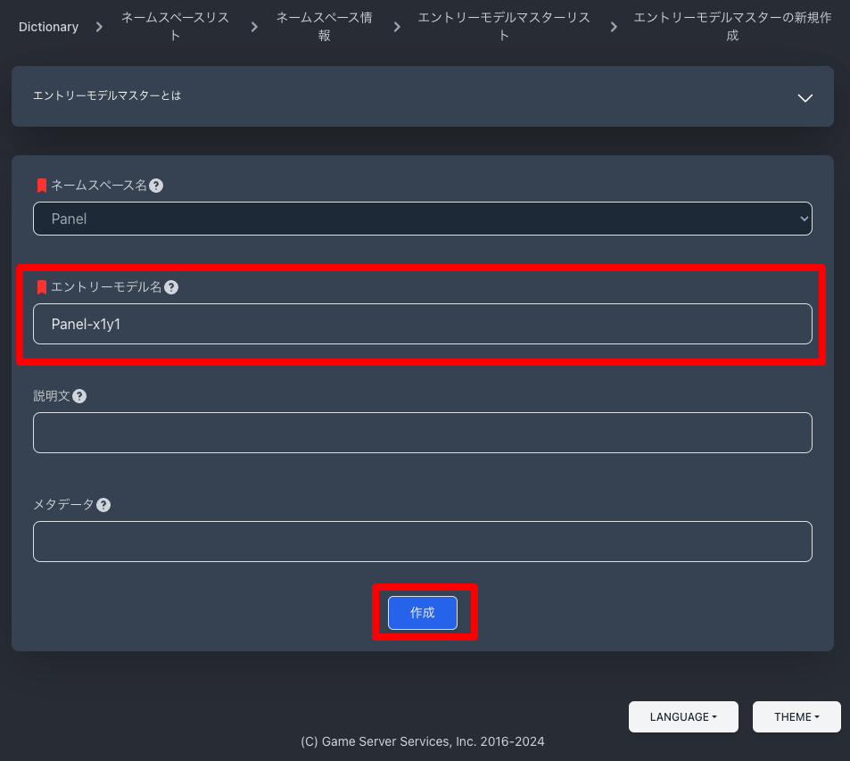

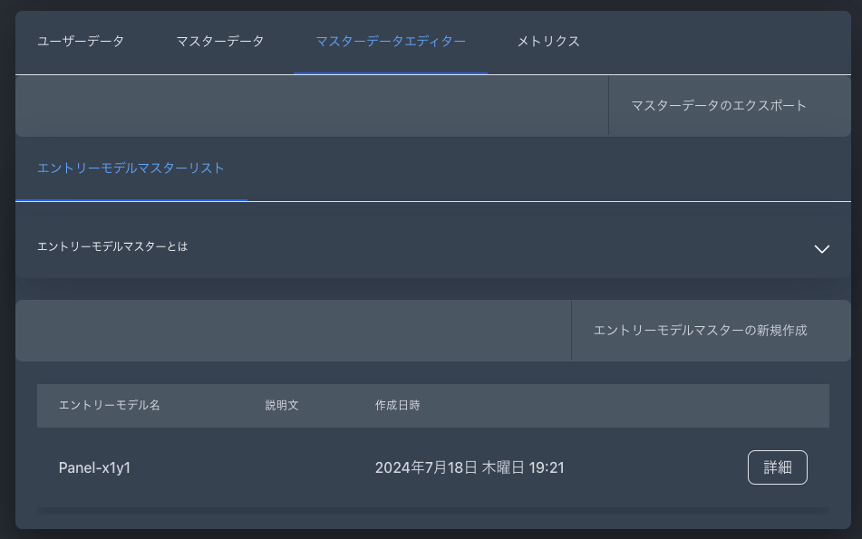

同様の手順で

- Panel-x1y2
- Panel-x1y3
- Panel-x2y1
- Panel-x2y2
- Panel-x2y3
- Panel-x3y1
- Panel-x3y2
- Panel-x3y3

のエントリーモデルを作成します。

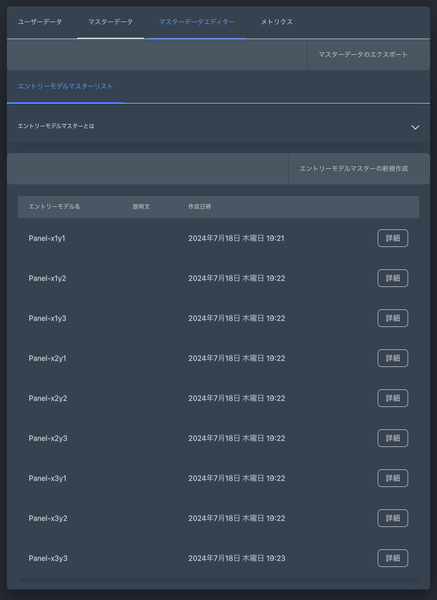

### マスターデータをエクスポート

次に、マスターデータをエクスポートします。手順は GS2-Inventory や GS2-Exchange の時と同じです。

```json
{
  "version": "2020-04-30",
  "entryModels": [
    {
      "name": "Panel-x1y1"
    },
    {
      "name": "Panel-x1y2"
    },
    {
      "name": "Panel-x1y3"
    },
    {
      "name": "Panel-x2y1"
    },
    {
      "name": "Panel-x2y2"
    },
    {
      "name": "Panel-x2y3"
    },
    {
      "name": "Panel-x3y1"
    },
    {
      "name": "Panel-x3y2"
    },
    {
      "name": "Panel-x3y3"
    }
  ]
}
```

### マスターデータのインポート

次に、マスターデータをインポートします。手順は GS2-Inventory や GS2-Exchange の時と同じです。

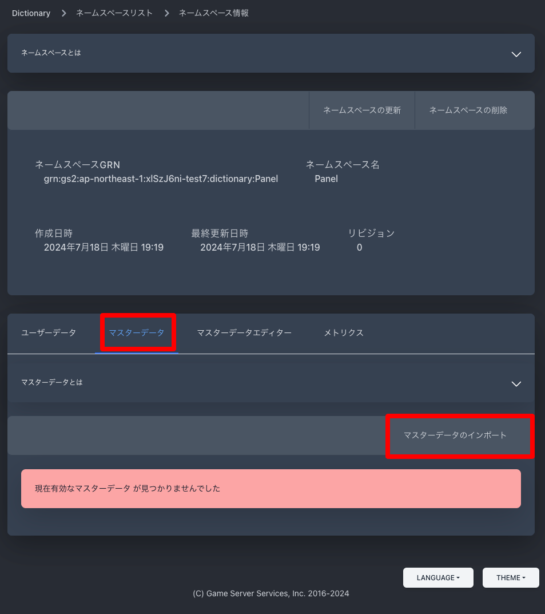

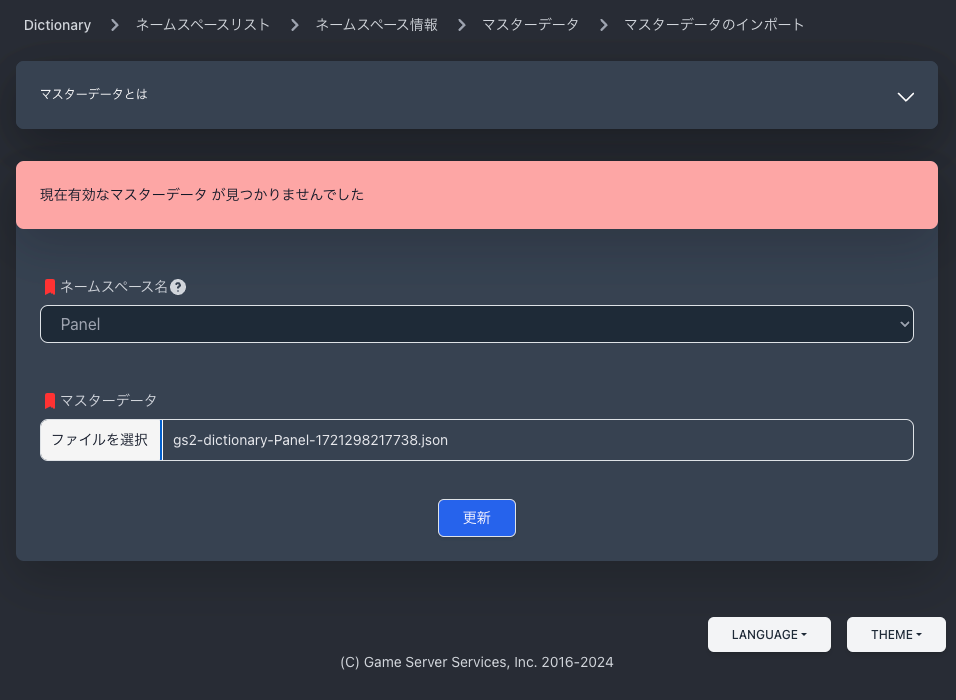

これで Unity から利用可能な状態になりました。

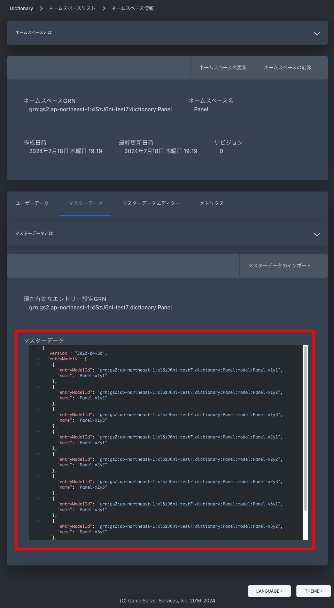

## 次のステップへ

[GS2-Lottery にパネルを排出するガチャを登録](../step0007)