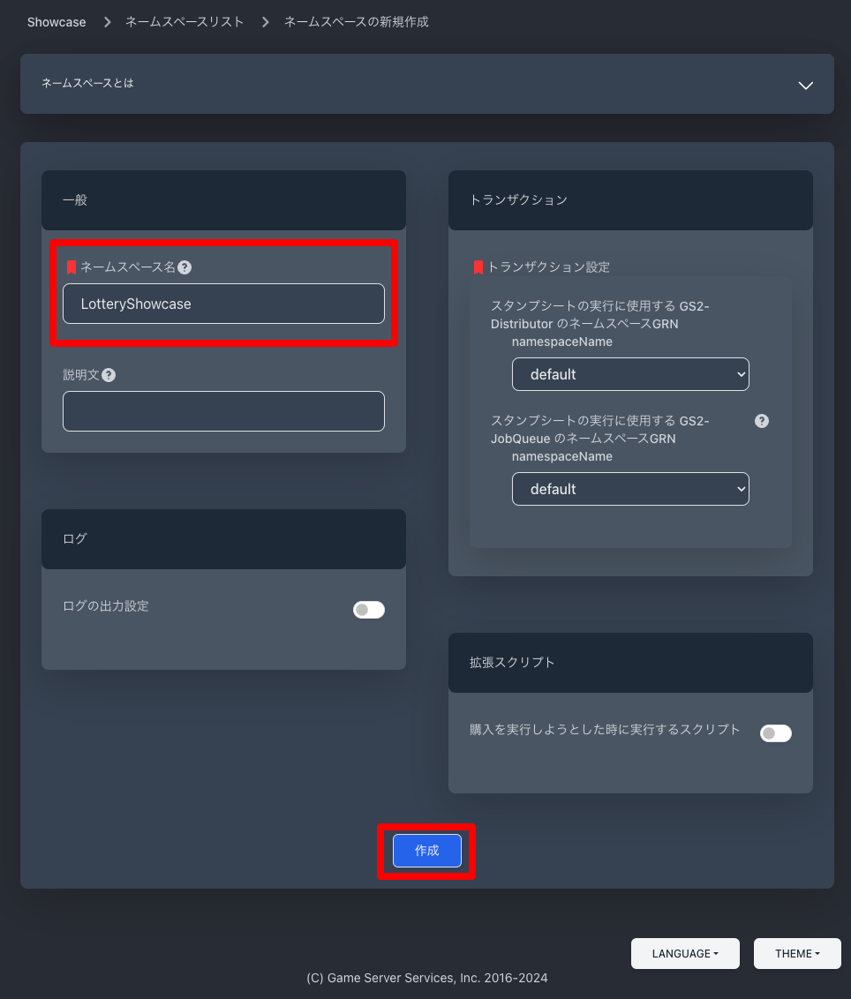
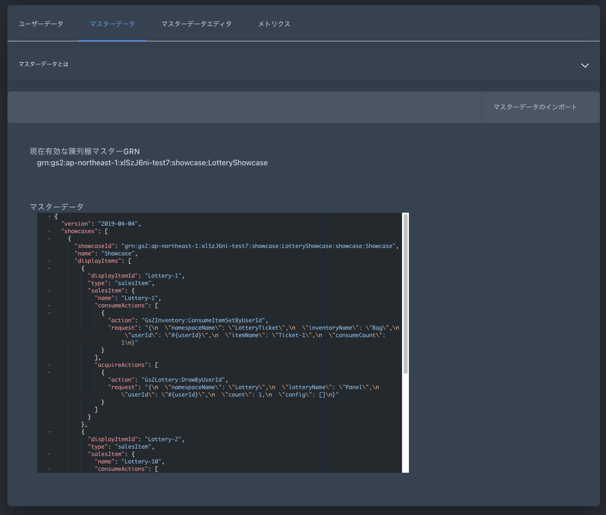

# GS2-Showcase にガチャチケットを消費してガチャを引く商品を登録

## GS2-Showcase の設定

### ネームスペースの作成

まずは、GS2-Showcase にガチャを引くために購入する商品を管理するネームスペースを作成します。
今回のサンプルは商品の陳列棚を利用しないため GS2-Exchange でも代用可能なのですが、少しでも多くのマイクロサービスを利用することで理解を深めていただきたく GS2-Showcase を選択しています。

マネージメントコンソールのサイドメニューから「Showcase > Namespaces」を選択します。


次に「ネームスペースの新規作成」を選択します。


ネームスペースの設定項目を入力して「作成」ボタンを押下します。




### マスターデータの作成

#### 商品を登録

これまでと同様にマスターデータエディタを選択します。


「商品の新規作成」を選択します。


商品名に「Lottery-1」を指定し、消費アクションリストの「＋」を選択します。


続けて、「入手アクションリスト」の「＋」を選択します。


「スタンプシートを使用して実行するアクションの種類」に「GS2-Lottery: ユーザーIDを指定して抽選を実行」を選択します。


抽選を実行する抽選モデルの情報を選択します。


作成を選択します。

続けて、10連ガチャの商品を登録します。


商品名に「Lottery-10」を指定し、消費アクションリストのでは「Ticket-10」を「1」個消費するように設定します。
入手アクションリストでは、抽選回数に「10」を設定します。


#### 陳列棚を登録

「陳列棚マスターの新規作成」を選択します。


陳列棚の名前に「Showcase」を指定し、陳列された商品リストに「Lottery-1」と「Lottery-10」を登録します。


### マスターデータをエクスポート

次に、マスターデータをエクスポートします。手順は GS2-Inventory や GS2-Exchange の時と同じです。


```json
{
  "version": "2019-04-04",
  "showcases": [
    {
      "name": "Showcase",
      "displayItems": [
        {
          "displayItemId": "Lottery-1",
          "type": "salesItem",
          "salesItem": {
            "name": "Lottery-1",
            "consumeActions": [
              {
                "action": "Gs2Inventory:ConsumeItemSetByUserId",
                "request": "{\n  \"namespaceName\": \"LotteryTicket\",\n  \"inventoryName\": \"Bag\",\n  \"userId\": \"#{userId}\",\n  \"itemName\": \"Ticket-1\",\n  \"consumeCount\": 1\n}"
              }
            ],
            "acquireActions": [
              {
                "action": "Gs2Lottery:DrawByUserId",
                "request": "{\n  \"namespaceName\": \"Lottery\",\n  \"lotteryName\": \"Panel\",\n  \"userId\": \"#{userId}\",\n  \"count\": 1,\n  \"config\": []\n}"
              }
            ]
          }
        },
        {
          "displayItemId": "Lottery-10",
          "type": "salesItem",
          "salesItem": {
            "name": "Lottery-10",
            "consumeActions": [
              {
                "action": "Gs2Inventory:ConsumeItemSetByUserId",
                "request": "{\n  \"namespaceName\": \"LotteryTicket\",\n  \"inventoryName\": \"Bag\",\n  \"userId\": \"#{userId}\",\n  \"itemName\": \"Ticket-10\",\n  \"consumeCount\": 1\n}"
              }
            ],
            "acquireActions": [
              {
                "action": "Gs2Lottery:DrawByUserId",
                "request": "{\n  \"namespaceName\": \"Lottery\",\n  \"lotteryName\": \"Panel\",\n  \"userId\": \"#{userId}\",\n  \"count\": 10,\n  \"config\": []\n}"
              }
            ]
          }
        }
      ]
    }
  ],
  "randomShowcases": []
}
```

### マスターデータのインポート

エクスポートしたマスターデータをインポートします。


エクスポートした JSON ファイルを選択して「更新」ボタンを押下します。


以上で GS2-Showcase の設定は完了です。



## 次のステップへ

[GS2-Showcase にガチャチケットを消費してガチャを引く商品を登録](../step0007)