# Unity 上で GS2-Showcase の商品を購入してガチャを引けるように

### 抽選結果画面を作成

抽選処理完了後に表示される抽選結果画面を作成します。
抽選結果画面には以下の Prefab を使用します。ダウンロードしたデータをプロジェクトの「Assets/Prefabs」に配置します。

[抽選結果画面の Prefab](prefab/LotteryPanel.prefab)

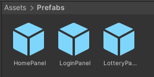

次に、LotteryPanel をシーンに配置します。

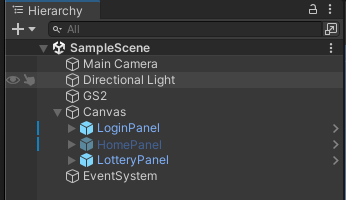

LotteryPanel はデフォルトで無効化し、抽選完了時に表示するようにします。

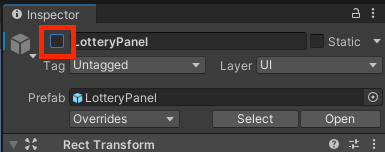

### 抽選結果を表示するように

抽選結果を表示する C# コードを作成します。
LotteryResult.cs を作成し、以下のコードを記述します。

```csharp
using System;
using System.Collections;
using System.Linq;
using Cysharp.Threading.Tasks;
using Cysharp.Threading.Tasks.Linq;
using Gs2.Core.Exception;
using Gs2.Unity.Gs2Lottery.Model;
using Gs2.Unity.Util;
using TMPro;
using UnityEngine;
using UnityEngine.Events;

public class LotteryResult : MonoBehaviour
{
    [SerializeField] private TMP_Text result;

    public SuccessEvent onReload;
    public ErrorEvent onFailure;
    
    private void OnEnable() {
        async UniTask SubscribeAsync()
        {
            void Reload(EzDrawnPrize[] drawnPrizes) {
                this.result.SetText(string.Join(", ", drawnPrizes.Select(drawnPrize => drawnPrize.PrizeId)));
                this.onReload.Invoke();
            }
            
            try
            {
                var domain = Gs2ClientHolder.Instance.Gs2.Lottery.Namespace(
                    namespaceName: "Lottery"
                );
                
                // 抽選結果に変化があった時に呼び出されるコールバックを追加
                domain.SubscribeDrawnPrizes(Reload);
                
                // 初期値を設定
                Reload(await domain.DrawnPrizesAsync().ToArrayAsync());
            }
            catch (Gs2Exception e)
            {
                this.onFailure.Invoke(e, null);
            }
        }
        StartCoroutine(SubscribeAsync().ToCoroutine());
    }

    [Serializable]
    public class SuccessEvent : UnityEvent
    {
    }
    
    [Serializable]
    public class ErrorEvent : UnityEvent<Gs2Exception, Func<IEnumerator>>
    {
    }
}
```

この C# のコードを LotteryPanel にアタッチします。

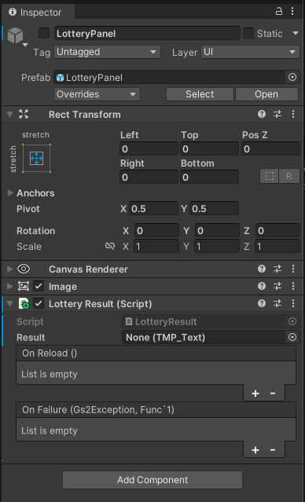

Result に結果表示テキスト（LotteryPanel/LotteryDialog/Text(TMP)）をアタッチします。

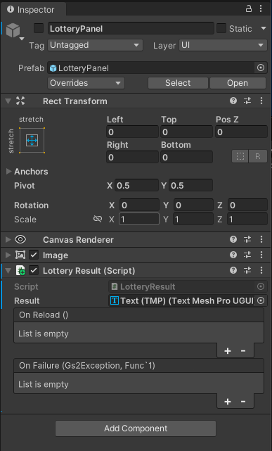

エラーハンドラーを設定します。

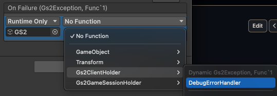

### 抽選処理を実行するように

抽選処理を実行する C# コードを作成します。
Lottery.cs を作成し、以下のコードを記述します。

```csharp
using System;
using System.Collections;
using Cysharp.Threading.Tasks;
using Gs2.Core.Exception;
using Gs2.Unity.Util;
using UnityEngine;
using UnityEngine.Events;

public class Lottery : MonoBehaviour
{
    public SuccessEvent onSuccess;
    public ErrorEvent onFailure;
    
    public void Draw(string displayItemId)
    {
        async UniTask LotteryAsync(string displayItemId)
        {
            try
            {
                // 抽選結果をクリア
                Gs2ClientHolder.Instance.Gs2.Lottery.ClearDrawnResult(
                    namespaceName: "Lottery"
                );
                
                // 商品を購入
                var transaction = await Gs2ClientHolder.Instance.Gs2.Showcase.Namespace(
                    namespaceName: "LotteryShowcase"
                ).Me(
                    gameSession: Gs2GameSessionHolder.Instance.GameSession
                ).Showcase(
                    "Showcase"
                ).DisplayItem(
                    displayItemId: displayItemId
                ).BuyAsync(
                    1
                );
            
                // 商品の購入処理の完了を待機
                await transaction.WaitAsync(true);
                
                // 完了をコールバック
                this.onSuccess.Invoke();
            }
            catch (Gs2Exception e)
            {
                this.onFailure.Invoke(e, () => LotteryAsync(displayItemId).ToCoroutine());
            }
        }
        StartCoroutine(LotteryAsync(displayItemId).ToCoroutine());
    }
    
    [Serializable]
    public class SuccessEvent : UnityEvent
    {
    }
    
    [Serializable]
    public class ErrorEvent : UnityEvent<Gs2Exception, Func<IEnumerator>>
    {
    }
}
```

この C# のコードを 「HomePanel/Lottery Gacha-1 Button」 にアタッチします。

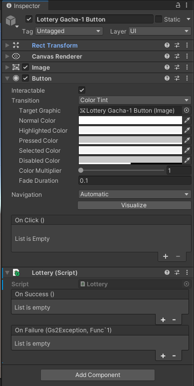

OnClick に Lottery.Draw をアタッチします。

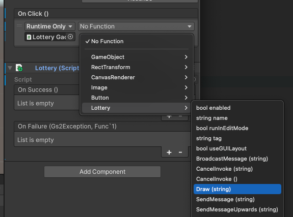

引数に GS2-Showcase の DisplayItemID を指定する必要があるので「Lottery-1」を指定します。

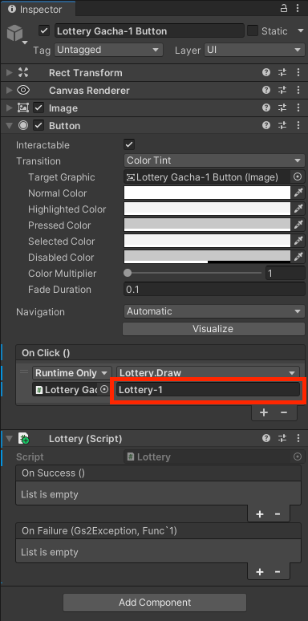

次に、抽選が完了したら抽選結果画面を表示するようにします。


エラーハンドラーを設定します。

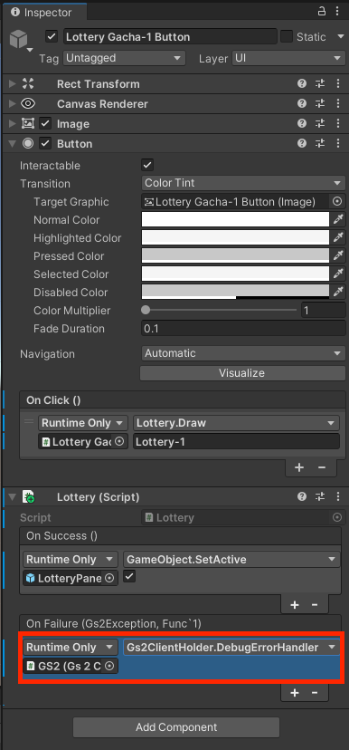

10連ガチャを引くためのボタンも設定します。「HomePanel/Lottery Gacha-10 Button」に Lottery.cs をアタッチし、各項目を設定します。

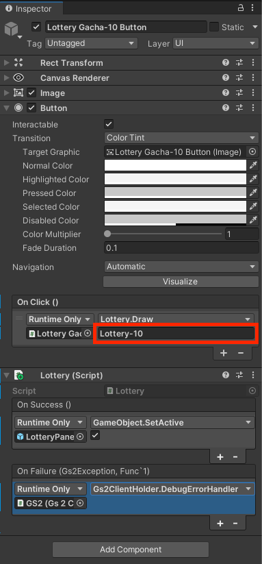

### 実行

まずは 「Acquire Ticket-1」を選択して、ガチャチケットを入手します。

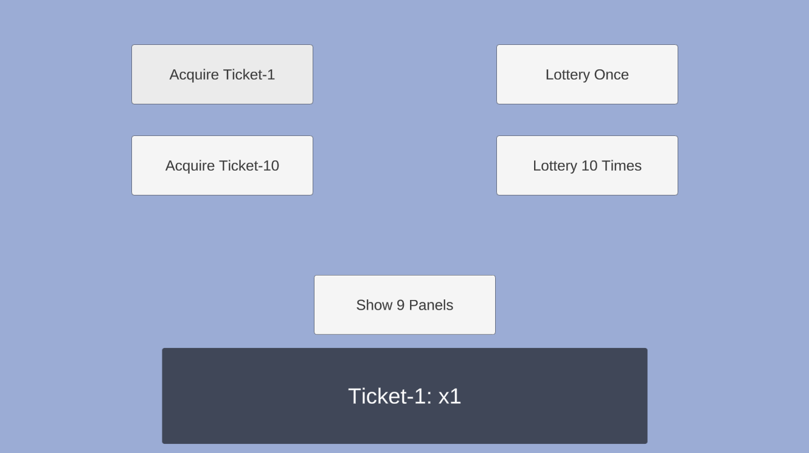

次に 「Lottery Once」 を選択して、ガチャを引きます。

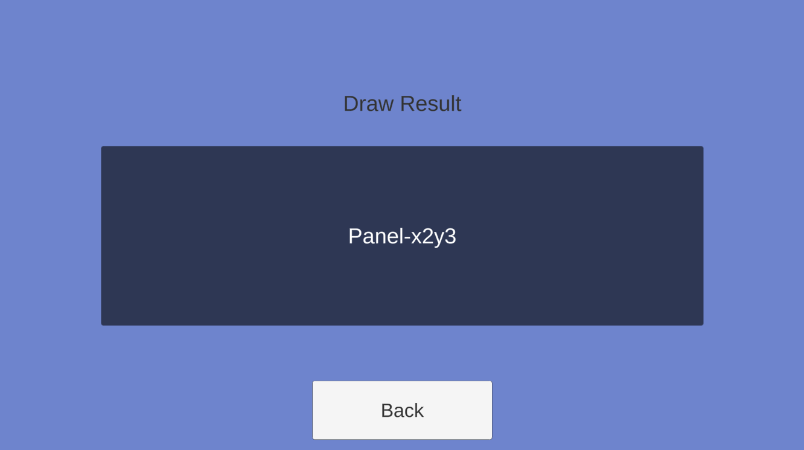

ガチャの結果が表示されます。
結果を確認したら「Back」ボタンを押下します。

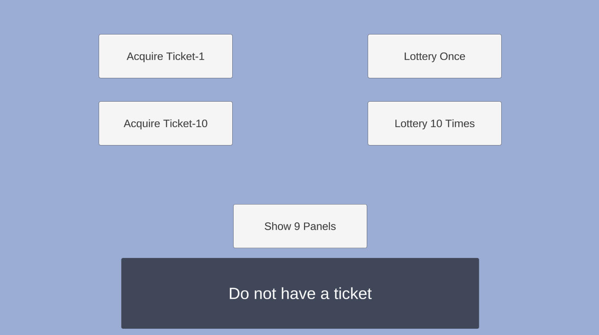

チケットを持っていない状態でホーム画面に戻ります。
この状態で再度「Lottery Once」を選択します。

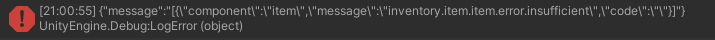

コンソールにアイテムの所持数量が不足している旨のエラーが表示されます。
適切にエラーハンドリングしてエラーダイアログを出すようにするとよりよくなるでしょう。

次に「Acquire Ticket-10」を選択して、10連ガチャチケットを入手します。

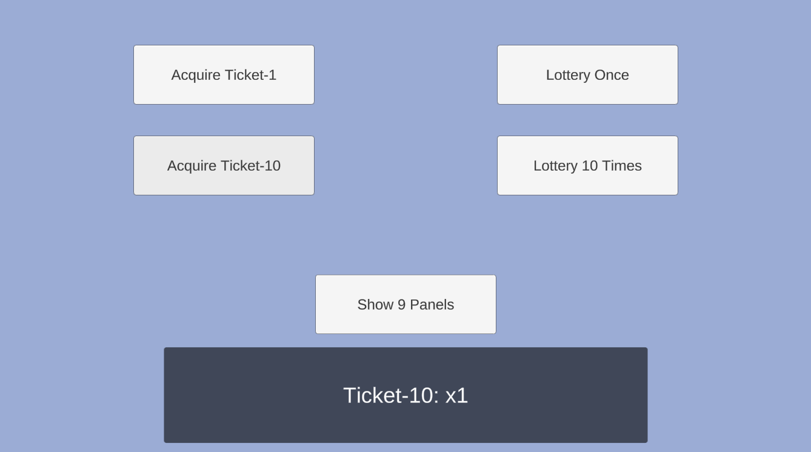

「Lottery 10 Times」を選択して、10連ガチャを引きます。

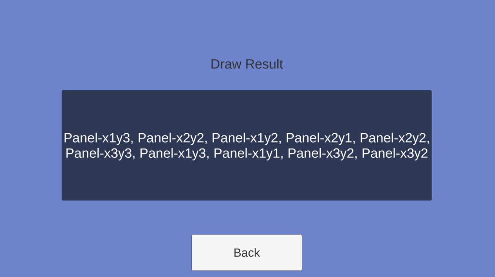

10連分の抽選結果が表示されます。

## このステップが終わった段階でのプロジェクト

[ソースコード](src)

## 次のステップへ

[Unity 上で GS2-Dictionary の登録情報を参照して 9パネルの状態を表示](../step0010)