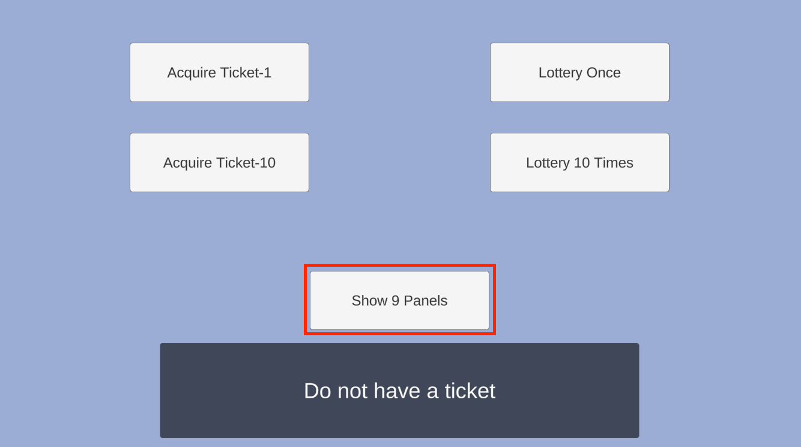

# Unity 上で GS2-Dictionary の登録情報を参照して 9パネルの状態を表示

### 9パネル状態画面を作成

抽選で獲得したパネルを確認する9パネル状態画面を作成します。
9パネル状態画面には以下の Prefab を使用します。ダウンロードしたデータをプロジェクトの「Assets/Prefabs」に配置します。

[9パネル状態画面の Prefab](prefab/DictionaryPanel.prefab)


次に、DictionaryPanel をシーンに配置します。


DictionaryPanel はデフォルトで無効化し、ホーム画面で 「Show 9 Panels」 選択時に表示するようにします。


### 9パネルの所持状況を表示するように

9パネルの所持状況を表示する C# コードを作成します。
PanelStatus.cs を作成し、以下のコードを記述します。

```csharp
using System;
using System.Collections;
using System.Linq;
using Cysharp.Threading.Tasks;
using Cysharp.Threading.Tasks.Linq;
using Gs2.Core.Exception;
using Gs2.Unity.Gs2Dictionary.Model;
using Gs2.Unity.Util;
using UnityEngine;
using UnityEngine.Events;

public class PanelStatus : MonoBehaviour
{
    [SerializeField] public GameObject[] panels = new GameObject[9];
    
    public SuccessEvent onReload;
    public ErrorEvent onFailure;
        
    private void OnEnable()
    {
        async UniTask OpenAsync()
        {
            void Reload(EzEntry[] entries) {
                foreach (var panel in this.panels) {
                    var match = entries.FirstOrDefault(entry => panel.name == entry.Name);
                    panel.SetActive(match != null);
                }
                this.onReload.Invoke();
            }

            try
            {
                var domain = Gs2ClientHolder.Instance.Gs2.Dictionary.Namespace(
                    namespaceName: "Panel"
                ).Me(
                    gameSession: Gs2GameSessionHolder.Instance.GameSession
                );
                domain.SubscribeEntries(Reload);
                Reload(await domain.EntriesAsync().ToArrayAsync());
            }
            catch (Gs2Exception e)
            {
                this.onFailure.Invoke(e, () => OpenAsync().ToCoroutine());
                return;
            }
        }
        
        StartCoroutine(OpenAsync().ToCoroutine());
    }
    
    [Serializable]
    public class SuccessEvent : UnityEvent
    {
    }
    
    [Serializable]
    public class ErrorEvent : UnityEvent<Gs2Exception, Func<IEnumerator>>
    {
    }
}
```

この C# のコードを DictionaryPanel にアタッチします。


Panels に9パネルに対応した GameObject を設定します。


エラーハンドラーを設定します。


「HomePanel/Show Dictionary Button」の OnClick で DictionaryPanel をアクティブ化するようにします。


## 実行

「Acquire Ticket-1」を押下し、単発ガチャチケットを入手します。


「Lottery Once」を押下し、ガチャを引きます。


ガチャの結果を確認したら「Back」 を押下し、ホーム画面に戻ります。



Show 9 Panels を選択します。


入手したパネルのみが表示されます。

## このステップが終わった段階でのプロジェクト

[ソースコード](src)

## 次へ

[マネージメントコンソールで行った操作を自動化する](../step0011)