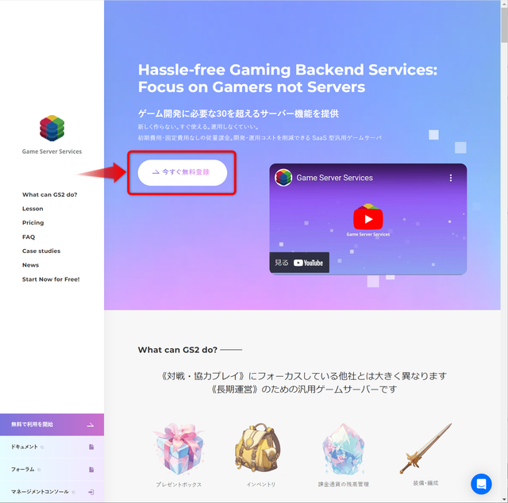
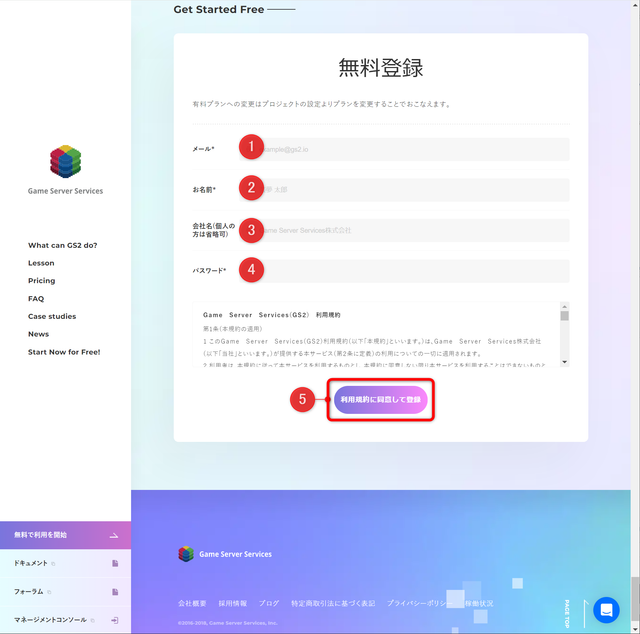
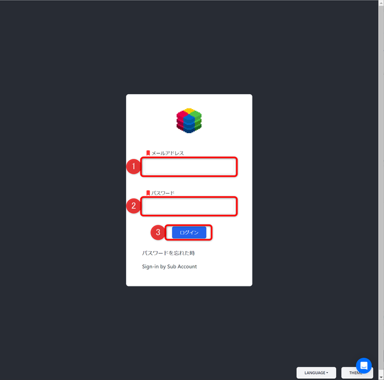
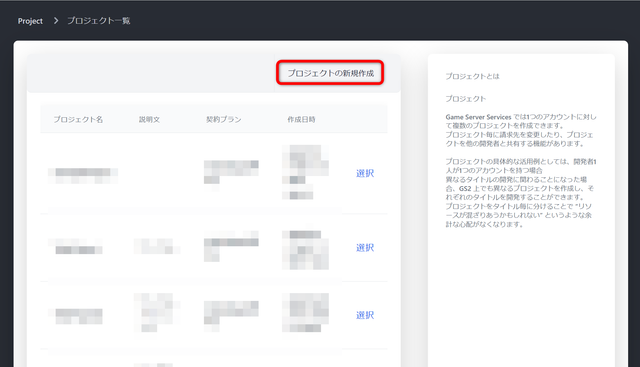
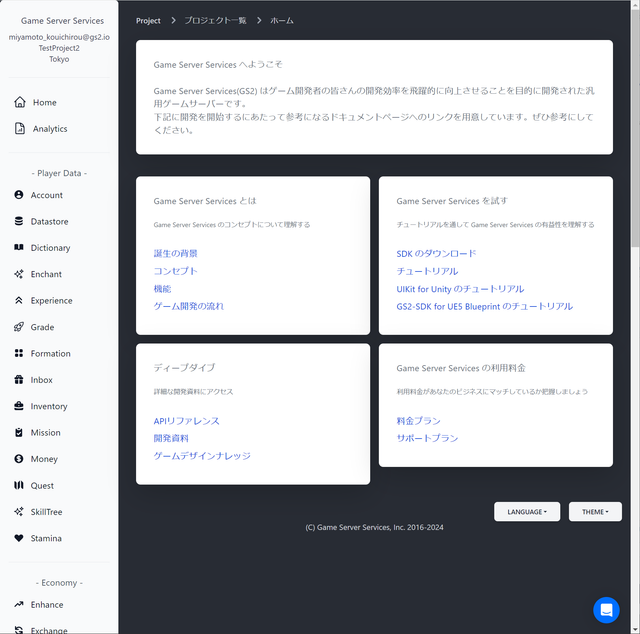

# GS2アカウントの作成〜プロジェクトの作成

## GS2のアカウント登録

[Game Server Services](https://gs2.io) のトップページから、アカウントの登録を行います。

メールアドレス、お名前、会社名（個人の開発者の方は省略可）、マネージメントコンソールへのログイン時に使用するパスワードを登録し、利用規約を確認の上、同意して登録のボタンを押します。

GS2からメールアドレスの確認メールが届きます。URLにアクセスし、認証を完了します。

## GS2のプロジェクト作成

[マネージメントコンソール](https://app.gs2.io) にアクセスして、ログインします。

プロジェクトの選択画面で、新規プロジェクトを作成します。

プロジェクトの作成が完了すると、 ホーム画面が表示されます。

## 次のステップへ

[Unityプロジェクトの準備](../step0001)