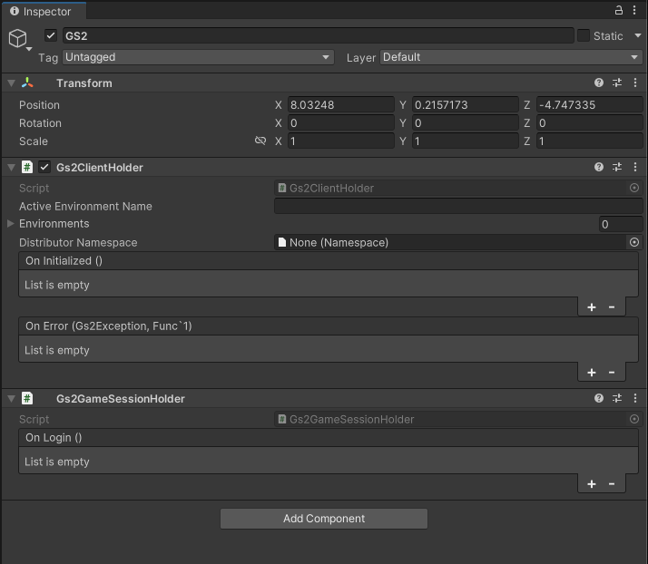
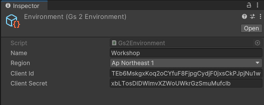

# GS2-Account でログイン処理を実装

## GS2-SDK の初期化

### 環境情報を作成

シーン内に GameObject を追加します。
作成した GameObject の名前を「GS2」とします。


Gs2ClientHolder　と　Gs2GameSessionHolder　コンポーネントを配置します。




「Environment」を作成します。


Environment に値を設定します。
Name には環境名を入力します。今回は「Workshop」とします。
Region には GS2 のデータセンターの地域を指定します。今回は「Ap Northeast 1」を指定します。
Client Id と Client Secret には、マネージメントコンソールで確認できる値を入力します。




### GS2-SDK の設定に Environment を設定

先ほど作成した GS2 GameObject のインスペクターを開きます。


Active Environment Name に「Workshop」と入力し、Environments の「＋」を選択し、先ほど作成した Environment を指定します。


### GS2-SDK の初期化完了をハンドリング

GS2-SDK の初期化が完了した際に、ログインボタンを有効化するようにします。
ログインボタンには以下の Prefab を使用します。ダウンロードしたデータをプロジェクトの「Assets/Prefabs」に配置します。
「Prefabs」 ディレクトリは存在しないため、新規作成した上で配置してください。

[ログインボタンの Prefab](prefab/LoginPanel.prefab)


次に、LoginPanel をシーンに配置します。
まずは、Canvas を作成します。


Canvas の下に先ほどダウンロードした LoginPanel.prefab を配置します。


LoginPanel の下には LoginButton が配置されています。


このボタンはデフォルトでは無効化されています。


ここを SDK の初期化完了とともに有効化するようにしましょう。

SDK の初期化完了イベントは Gs2ClientHolder から受け取ることができます。


これで、GS2-SDK の初期化完了をハンドリングできました。

## ログイン処理の実装

### GS2-Account の設定

まずは、GS2-Account にアカウント情報を作成するためのネームスペースを作成します。

マネージメントコンソールのサイドメニューから「Account > Namespaces」を選択します。


次に「ネームスペースの新規作成」を選択します。


ネームスペースの設定項目を入力して「作成」ボタンを押下します。


これで GS2-Account の設定は完了です。


### C# コードを実装

次に、アカウントの新規作成処理を実装します。

C# スクリプトを Login.cs という名前で作成し、以下のコードを記述します。


```csharp
using System;
using System.Collections;
using Cysharp.Threading.Tasks;
using Gs2.Core.Exception;
using Gs2.Unity.Util;
using Gs2.Util.WebSocketSharp;
using UnityEngine;
using UnityEngine.Events;

public class Login : MonoBehaviour
{
    public string accountNamespaceName;
    
    public SuccessEvent onSuccess;
    public ErrorEvent onFailure;

    [SerializeField] public string userId;
    [SerializeField] public string password;
    
    public void OnLogin()
    {
        async UniTask LoginAsync()
        {
            try {
                if (this.userId.IsNullOrEmpty() && this.password.IsNullOrEmpty())
                {
                    // Create an anonymous _ezAccount
                    var result = await Gs2ClientHolder.Instance.Gs2.Account.Namespace(
                        namespaceName: this.accountNamespaceName
                    ).CreateAsync();
                    var account = await result.ModelAsync();
                    this.userId = account.UserId;
                    this.password = account.Password;
                }
                
                Debug.Log($"UserId: {this.userId}");
                Debug.Log($"Password: {this.password}");
    
                // Log-in created anonymous _ezAccount
                var gameSession = await Gs2ClientHolder.Instance.Gs2.LoginAsync(
                    new Gs2AccountAuthenticator(
                        accountSetting: new AccountSetting
                        {
                            accountNamespaceName = this.accountNamespaceName,
                        }
                    ),
                    this.userId,
                    this.password
                );
                
                this.onSuccess.Invoke(gameSession);
            }
            catch (Gs2Exception e)
            {
                this.onFailure.Invoke(e, () => LoginAsync().ToCoroutine());
            }
        }
        StartCoroutine(LoginAsync().ToCoroutine());
    }

    [Serializable]
    public class SuccessEvent : UnityEvent<GameSession>
    {
    }
    
    [Serializable]
    public class ErrorEvent : UnityEvent<Gs2Exception, Func<IEnumerator>>
    {
    }
    
    public void DebugErrorHandler(Gs2Exception e, Func<IEnumerator> retry) {
        Debug.LogError($"{e.GetType()} {string.Join(",", e.Errors.Select(v => v.Message))} : Retryable={retry != null}");
    }
}
```

### Unity への反映

次に、LoginPanel に Login.cs をアタッチします。


Account Namespace Name に先ほど作成した GS2-Account のネームスペース名である「default」を設定します。


次にログインが完了したら、Gs2GameSessionHolder にログイン情報を保持するようにします。

OnSuccess が呼び出された時に、Gs2GameSessionHolder の UpdateGameSession を呼び出すようにします。


最後に、ログインボタンを押下した際にログイン処理が実行されるようにします。

LoginButton の OnClick で LoginPanel の OnLogin を呼び出すようにします。


最後にログイン処理が完了したら LoginPanel を非表示にするようにします。


これで、GS2-Account でログイン処理を実装できました。

### 実行

それでは、実行してみましょう。

意図した通りに動きましたか？ 
動かなかった場合は続きのトラブルシュートを確認してください。

今後のためにも意図した通りに動いたとしてもトラブルシュートの方法については理解しておくと良いでしょう。

### エラーハンドリング

今のままでは何が原因で意図した通りに動かなかったのかがわかりません。
各処理にはエラーハンドリングのインターフェースが用意されています。まずはエラーハンドリングをして、どのようなエラーが発生しているのかを確認してみましょう。

#### SDK の初期化処理

SDK の初期化に失敗した場合のエラーハンドラは Gs2ClientHolder に用意されています。
第一引数にはエラーの内容、第二引数にはリトライが可能な場合はリトライ用のコルーチンが渡ってくるようになっています。


Gs2ClientHolder には以下のようなエラー内容を出力するだけのエラーハンドラが用意されています。
今回のワークショップのような実験レベルの実装では、リトライを作り込むほどでもなくエラー内容を確認できれば十分ですので、こちらを利用します。


#### ログイン処理

次にログイン処理です。先ほど作成した Login.cs でも同じエラーハンドリングインターフェースが実装されています。


こちらにもエラー内容を出力する Gs2ClientHolder のハンドラーを設定します。


### エラー内容の確認

では、再度実行してエラー内容を確認してみましょう。
以下のどれかに該当するメッセージがないか確認してください。それぞれの対処方法を記載しています。

#### prefab.GS2ClientHolder.activeEnvironmentName.error.notFound

Gs2ClientHolder に指定した Active Environment Name か Environment オブジェクトの名前のどちらかが不適切です

#### identifier.projectToken.clientId.error.require

Environment オブジェクトで Client ID が指定されていません

#### identifier.projectToken.clientSecret.error.require

Environment オブジェクトで Client Secret が指定されていません

#### identifier.identifier.clientSecret.error.invalid

Environment オブジェクトで指定した Client ID もしくは Client Secret が不適切です

#### account.namespace.namespace.error.notFound

Login に指定した GS2-Account のネームスペース名の指定が不適切です

#### なにも表示されない時

各種コンポーネントからのコールバック時のイベントハンドリングが適切に行えているか確認してください

## このステップが終わった段階でのプロジェクト

[ソースコード](src)

## 次のステップへ

[GS2-Inventory にガチャチケットのアイテムを登録](../step0003)