# GS2-Exchange にガチャチケットを入手する交換レートを登録

## GS2-Exchange の設定

### ネームスペースの作成

まずは、GS2-Exchange にガチャチケットを入手するための交換機能を実現するネームスペースを作成します。

マネージメントコンソールのサイドメニューから「Exchange > Namespaces」を選択します。

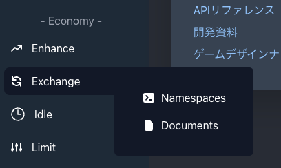

次に「ネームスペースの新規作成」を選択します。

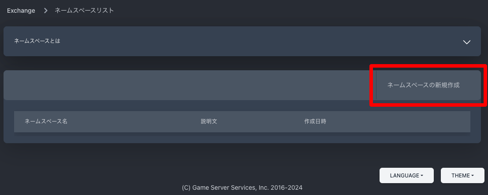

ネームスペースの設定項目を入力して「作成」ボタンを押下します。

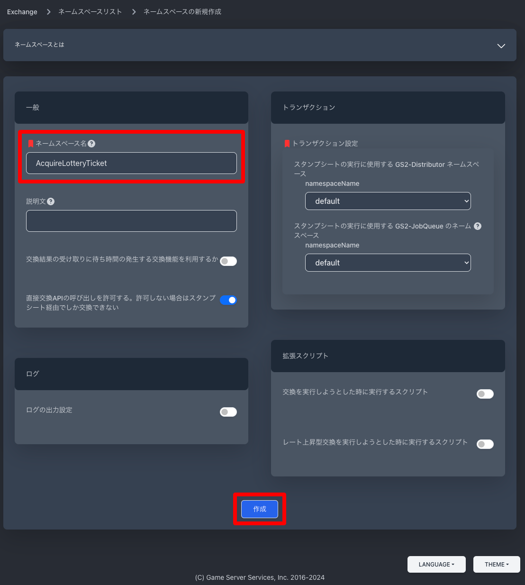

### マスターデータの作成

先ほどと同様にマスターデータエディタを選択します。

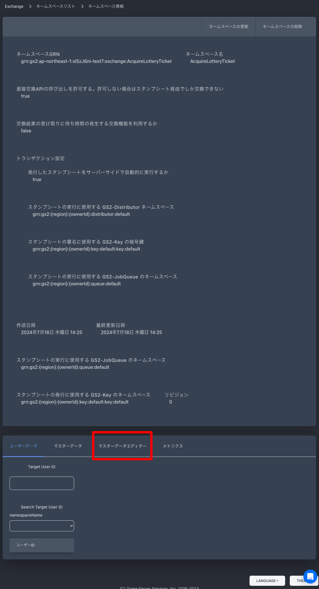

GS2-Exchange では複数のモードがありますが、今回は「スタンダード交換」を使用します。

「交換レートマスターの新規作成」を選択します。

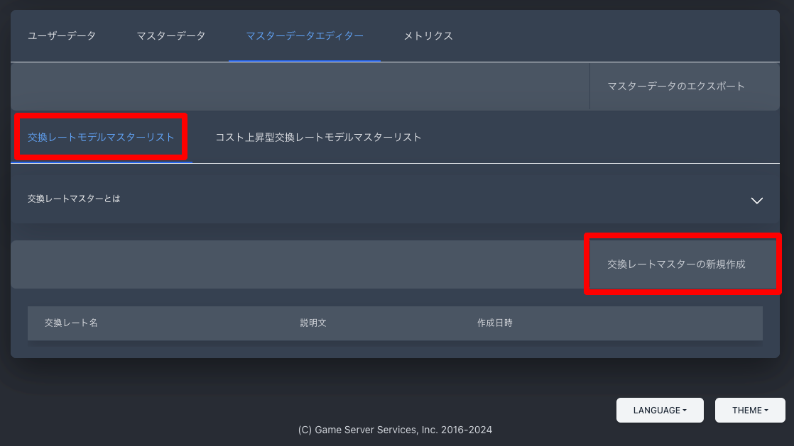

交換レートの名前を設定し、入手アクションリストの「＋」を選択します。

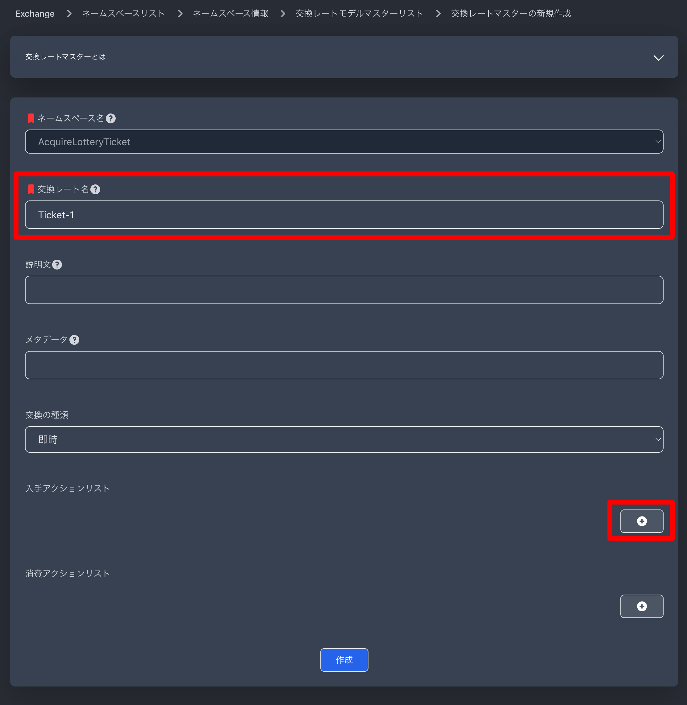

続けて、「スタンプシートを使用して実行するアクションの種類」に「GS2-Inventory: アイテムをインベントリに追加」を選択します。

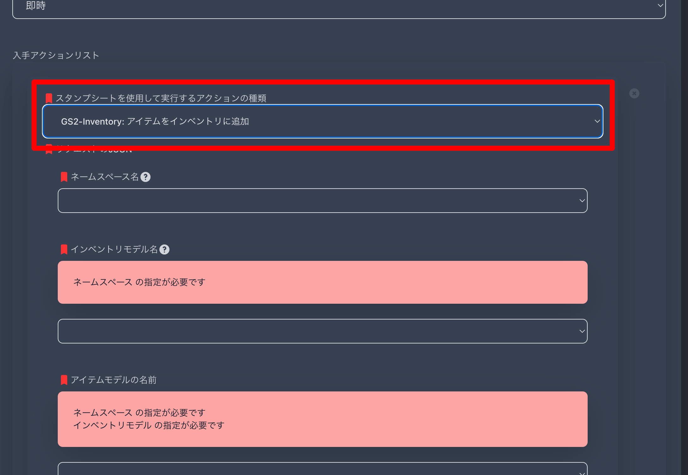

ネームスペース名、インベントリモデル名、アイテムモデル名 を設定し、入手する量に1を指定します。

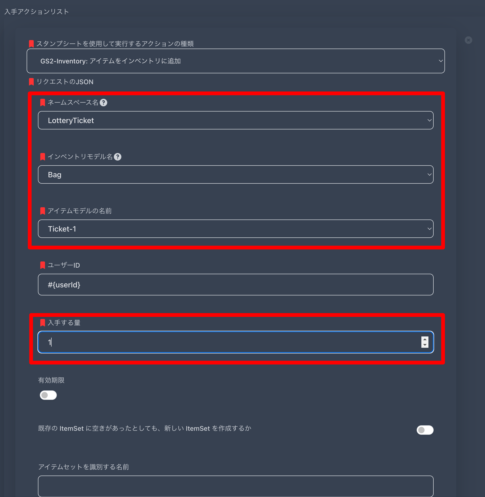

「作成」ボタンを押下して登録します。

次に、10連ガチャチケを入手するための交換レートを登録します。

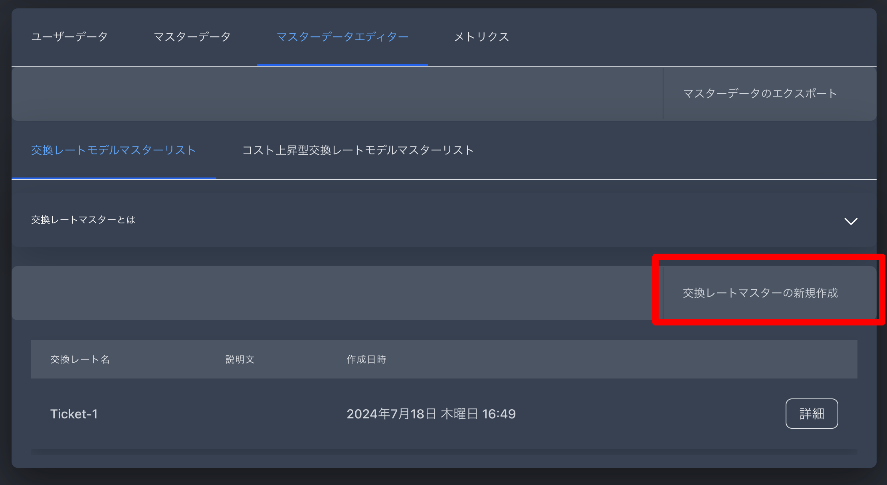

手順はほぼ同じですが、入手するアイテムだけ Ticket-10 を指定します。

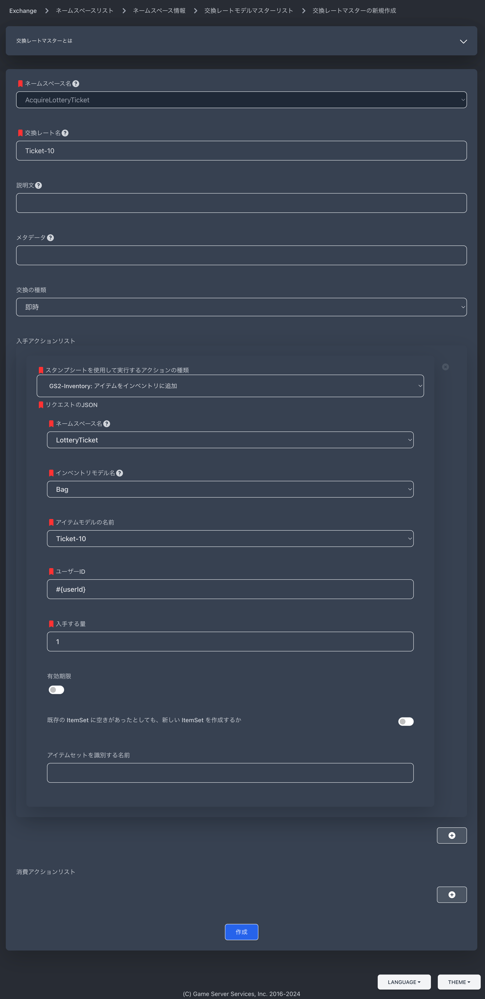

「作成」ボタンを押下して登録します。

### マスターデータをエクスポート

次に、マスターデータをエクスポートします。手順は GS2-Inventory の時と同じです。

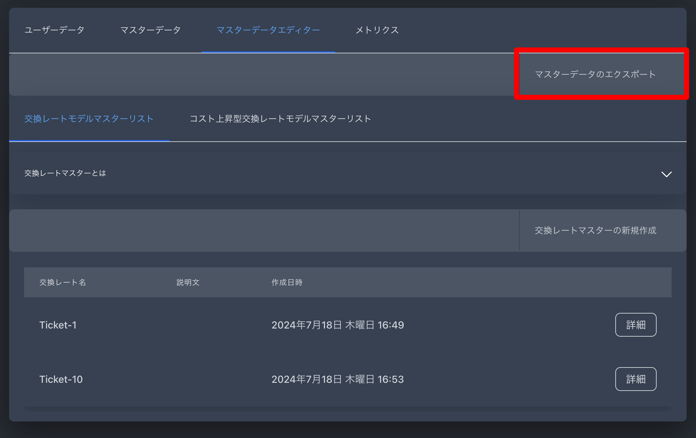

```json
{
  "version": "2019-08-19",
  "rateModels": [
    {
      "name": "Ticket-1",
      "consumeActions": [],
      "timingType": "immediate",
      "lockTime": 0,
      "acquireActions": [
        {
          "action": "Gs2Inventory:AcquireItemSetByUserId",
          "request": "{\n  \"namespaceName\": \"LotteryTicket\",\n  \"inventoryName\": \"Bag\",\n  \"itemName\": \"Ticket-1\",\n  \"userId\": \"#{userId}\",\n  \"acquireCount\": 1\n}"
        }
      ]
    },
    {
      "name": "Ticket-10",
      "consumeActions": [],
      "timingType": "immediate",
      "lockTime": 0,
      "acquireActions": [
        {
          "action": "Gs2Inventory:AcquireItemSetByUserId",
          "request": "{\n  \"namespaceName\": \"LotteryTicket\",\n  \"inventoryName\": \"Bag\",\n  \"itemName\": \"Ticket-10\",\n  \"userId\": \"#{userId}\",\n  \"acquireCount\": 1\n}"
        }
      ]
    }
  ],
  "incrementalRateModels": []
}
```

### マスターデータをインポート

ダウンロードしたJSONファイルをアップロードします。

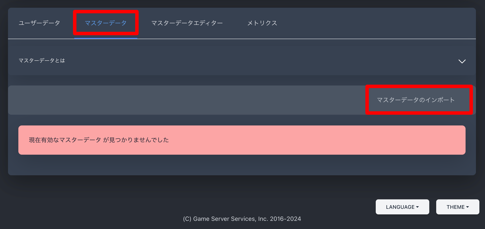

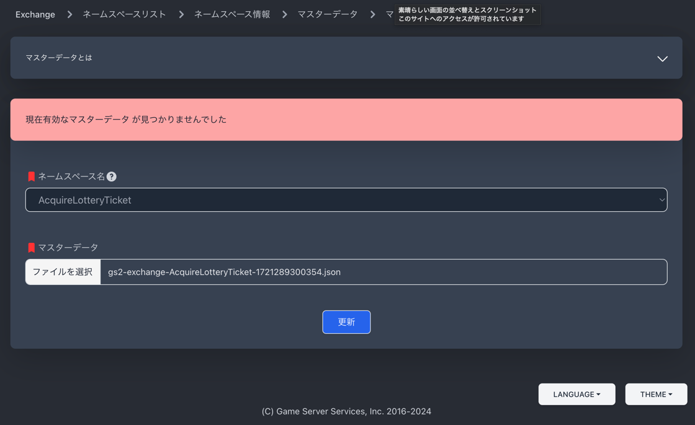

これで、GS2-Exchange にガチャチケットを入手するための交換レートが登録されました。

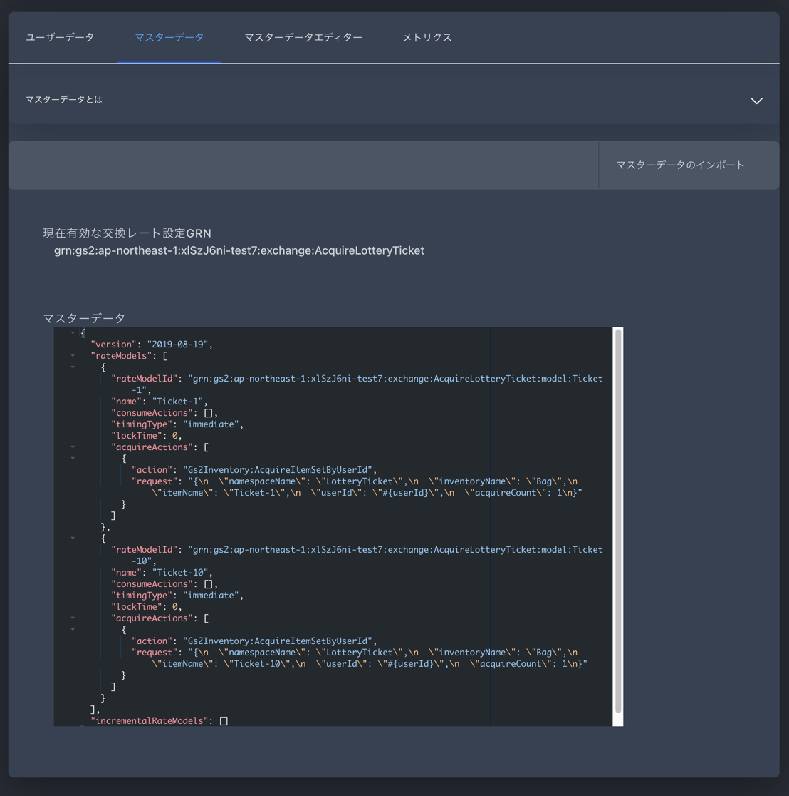

## 次のステップへ

[Unity 上で GS2-Exchange の交換を実行してガチャチケットを入手できるように](../step0005)